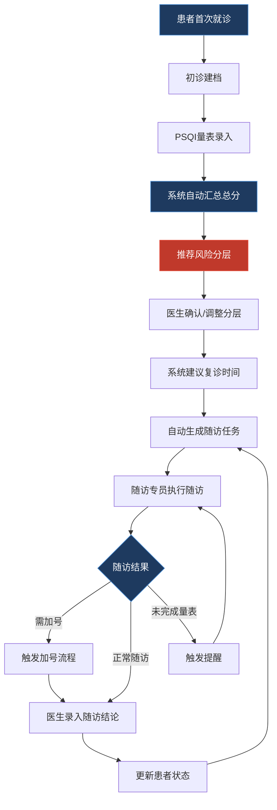

## 1. 产品概述

睡眠门诊智能工作台——面向睡眠门诊医生、护士和随访专员的一站式管理平台，将 PSQI 量表评估、风险分层管理与复诊追踪整合在同一套工作台内，消除纸笔登记与人工追踪的繁琐流程，让门诊团队在忙碌中快速判断谁该优先回访、谁需要加号复诊、谁可以继续居家观察。

## 2. 核心功能

### 2.1 用户角色

| 角色 | 登录方式 | 核心权限 |
|------|----------|----------|
| 医生 | 账号密码 | 全部功能：评估审核、风险分层确认、随访结论留档、预警处理、统计查看 |
| 护士 | 账号密码 | 评估录入、初诊建档、随访任务执行与记录、预警查看 |
| 随访专员 | 账号密码 | 随访任务执行与触达记录、未完成量表提醒、预警查看 |

### 2.2 功能模块

1. **患者列表页**：患者档案管理、搜索筛选、风险分层标签、快速跳转评估与随访
2. **评估录入页**：初诊建档、PSQI 七大分项录入与总分自动汇总、失眠主诉备注、用药与非药物干预记录、复诊时间建议
3. **随访计划页**：随访任务自动生成与手动调整、电话与短信触达记录、未完成量表提醒、医生随访结论留档
4. **预警看板页**：异常高分患者预警、逾期未复诊提醒、风险分层变动追踪、快捷操作入口
5. **统计报表页**：门诊量趋势、PSQI 评分分布、症状变化前后对比、干预效果分析

### 2.3 页面详情

| 页面名称 | 模块名称 | 功能描述 |
|----------|----------|----------|
| 患者列表 | 搜索与筛选栏 | 按姓名/编号搜索，按风险等级/状态/最近评估日期筛选 |
| 患者列表 | 患者卡片列表 | 展示姓名、编号、风险等级标签、最近PSQI总分、下次复诊日期、状态标记 |
| 患者列表 | 初诊建档弹窗 | 录入基本信息（姓名、性别、年龄、联系方式、主诉、既往史） |
| 患者列表 | 批量操作栏 | 批量发送提醒、导出患者列表 |
| 评估录入 | 患者信息摘要 | 顶部展示当前患者基本信息与历史PSQI趋势缩略图 |
| 评估录入 | PSQI分项录入表单 | 七大分项：主观睡眠质量、入睡时间、睡眠时间、睡眠效率、睡眠障碍、催眠药物、日间功能障碍，每项0-3分 |
| 评估录入 | 总分自动汇总 | 实时计算PSQI总分及各分项占比，以仪表盘/进度条可视化展示 |
| 评估录入 | 失眠主诉备注 | 自由文本区域，记录患者口述失眠类型、持续时间、诱因等 |
| 评估录入 | 风险分层标记 | 根据PSQI总分自动推荐分层（低危0-5/中危6-10/高危11-21），支持人工覆盖 |
| 评估录入 | 用药干预记录 | 记录当前用药方案（药物名称、剂量、频次、起止时间） |
| 评估录入 | 非药物干预记录 | CBT-I、睡眠卫生教育、放松训练等非药物方案 |
| 评估录入 | 复诊时间建议 | 根据风险等级自动推荐复诊间隔，支持手动调整确认 |
| 随访计划 | 随访任务列表 | 展示待执行/进行中/已完成的随访任务，按紧急度排序 |
| 随访计划 | 任务自动生成 | 评估完成后按风险等级自动生成随访任务（高危7天/中危14天/低危30天） |
| 随访计划 | 电话随访记录 | 记录通话时间、通话结果、患者反馈、是否需加号 |
| 随访计划 | 短信触达记录 | 发送提醒短信、量表链接，记录发送状态与阅读回执 |
| 随访计划 | 未完成量表提醒 | 检测患者未完成的量表评估，自动触发提醒任务 |
| 随访计划 | 随访结论留档 | 医生录入随访结论、后续计划、是否调整治疗方案 |
| 预警看板 | 高分预警卡片 | PSQI≥15分患者醒目展示，含最近评分与趋势 |
| 预警看板 | 逾期未复诊列表 | 超过建议复诊日期未回诊的患者列表 |
| 预警看板 | 风险变动通知 | 患者风险等级升降变动记录 |
| 预警看板 | 快捷操作 | 一键加号、一键发送提醒、一键拨打电话 |
| 统计报表 | 门诊量趋势 | 按日/周/月展示门诊量折线图 |
| 统计报表 | PSQI评分分布 | 柱状图展示各分段患者分布 |
| 统计报表 | 症状变化对比 | 选择患者后展示历次PSQI分项与总分变化折线图 |
| 统计报表 | 干预效果分析 | 对比干预前后PSQI评分变化 |

## 3. 核心流程

**初诊评估流程**：患者首次就诊→护士初诊建档→医生/护士录入PSQI量表→系统自动汇总总分→根据总分推荐风险分层→医生确认或调整分层→系统自动建议复诊时间→生成随访任务

**随访管理流程**：系统按风险等级生成随访任务→随访专员/护士执行电话或短信随访→记录随访结果→如需加号则触发加号流程→医生录入随访结论→更新患者状态

**预警处理流程**：系统检测异常高分/逾期未复诊/风险变动→推送至预警看板→值班人员查看并处理→标记处理结果

## 4. 用户界面设计

### 4.1 设计风格

- **主色调**：深夜蓝 `#0f1b2d` 作为背景主色，传达专业与宁静的睡眠医学氛围；搭配冷灰蓝 `#1e3a5f` 作为卡片与区域底色
- **强调色**：医疗橙 `#f0923b` 用于预警与关键操作，薄荷绿 `#2dd4a8` 用于正常状态与成功反馈
- **风险色系**：低危薄荷绿 `#2dd4a8`、中危琥珀黄 `#f5a623`、高危警报红 `#e74c3c`
- **按钮风格**：圆角8px，主操作按钮填充色、次要操作按钮描边风格
- **字体**：标题使用 Noto Serif SC（衬线体，传达医学专业感），正文使用 Noto Sans SC
- **布局风格**：左侧固定导航栏 + 右侧内容区，卡片式布局，顶部信息栏
- **图标风格**：线性图标，2px描边，圆角端点，配合微动画

### 4.2 页面设计概览

| 页面名称 | 模块名称 | UI要素 |
|----------|----------|--------|
| 患者列表 | 搜索筛选栏 | 顶部横栏，左搜索框右筛选下拉，浅底色区分 |
| 患者列表 | 患者卡片 | 左侧风险色条标识，内含姓名编号PSQI分数复诊日期，悬停微浮起 |
| 患者列表 | 建档弹窗 | 居中模态框，分步表单，顶部进度指示器 |
| 评估录入 | 患者摘要条 | 顶部横条，左侧头像与基本信息，右侧迷你趋势图 |
| 评估录入 | PSQI录入区 | 卡片式七分项，每项滑块或单选0-3，底部汇总仪表盘动画 |
| 评估录入 | 备注与干预区 | 折叠面板式，点击展开对应表单 |
| 随访计划 | 任务看板 | 三列看板（待执行/进行中/已完成），拖拽排序 |
| 随访计划 | 触达记录 | 时间线布局，区分电话（蓝）与短信（绿）图标 |
| 预警看板 | 预警卡片 | 大面积红色渐变背景，数字醒目，左侧闪烁指示灯 |
| 预警看板 | 快捷操作 | 悬浮操作栏，图标按钮横向排列 |
| 统计报表 | 图表区域 | 大尺寸图表卡片，顶部时间范围切换器 |

### 4.3 响应式设计

- 桌面优先设计，核心使用场景为诊室桌面端
- 最小支持1280px宽度，1920px为最佳体验
- 平板端适配：导航栏折叠为底部标签栏，卡片单列排布
- 移动端仅保留患者列表查询与预警查看功能

### 4.4 3D场景指引

不适用
