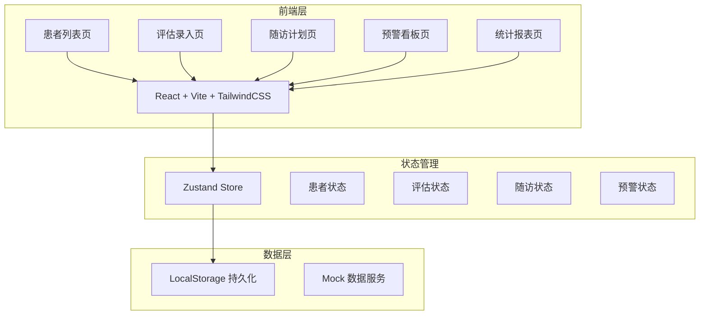
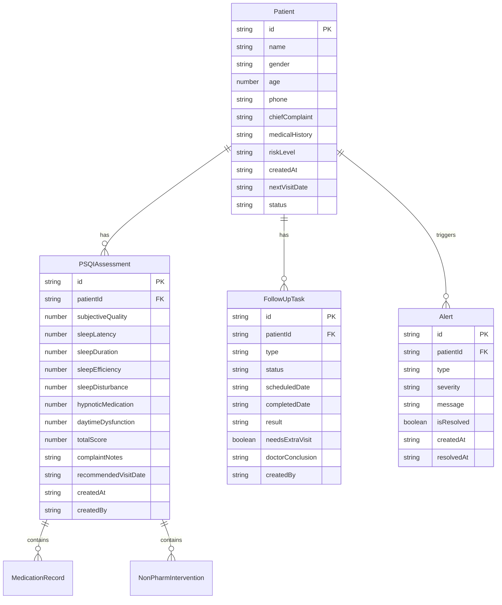

## 1. 架构设计



## 2. 技术说明

- **前端框架**：React@18 + TypeScript + Vite
- **样式方案**：TailwindCSS@3 + CSS Variables（主题色系）
- **状态管理**：Zustand（轻量级，适合单页应用）
- **路由方案**：React Router v6
- **图表库**：Recharts（轻量级 React 图表库）
- **图标库**：Lucide React
- **动画库**：Framer Motion
- **数据持久化**：LocalStorage（MVP 阶段使用 Mock 数据 + LocalStorage 持久化）
- **后端**：无（MVP 阶段纯前端，数据存储在 LocalStorage）

## 3. 路由定义

| 路由 | 用途 |
|------|------|
| `/` | 重定向至患者列表 |
| `/patients` | 患者列表页：搜索筛选、初诊建档、风险分层标签 |
| `/assessment/:id` | 评估录入页：PSQI量表录入、风险分层、干预记录 |
| `/follow-up` | 随访计划页：任务管理、触达记录、结论留档 |
| `/alerts` | 预警看板页：高分预警、逾期提醒、风险变动 |
| `/reports` | 统计报表页：趋势图表、评分分布、对比分析 |

## 4. API 定义

MVP 阶段无后端 API，使用 Mock 数据服务层模拟：

### 4.1 数据类型定义

```typescript
interface Patient {
  id: string;
  name: string;
  gender: 'male' | 'female';
  age: number;
  phone: string;
  chiefComplaint: string;
  medicalHistory: string;
  riskLevel: 'low' | 'medium' | 'high';
  createdAt: string;
  nextVisitDate: string | null;
  status: 'active' | 'inactive';
}

interface PSQIAssessment {
  id: string;
  patientId: string;
  subjectiveQuality: number;
  sleepLatency: number;
  sleepDuration: number;
  sleepEfficiency: number;
  sleepDisturbance: number;
  hypnoticMedication: number;
  daytimeDysfunction: number;
  totalScore: number;
  complaintNotes: string;
  medications: MedicationRecord[];
  nonPharmInterventions: NonPharmIntervention[];
  recommendedVisitDate: string;
  createdAt: string;
  createdBy: string;
}

interface MedicationRecord {
  name: string;
  dosage: string;
  frequency: string;
  startDate: string;
  endDate: string | null;
}

interface NonPharmIntervention {
  type: 'cbti' | 'sleepHygiene' | 'relaxation' | 'other';
  description: string;
  startDate: string;
}

interface FollowUpTask {
  id: string;
  patientId: string;
  type: 'phone' | 'sms' | 'visit';
  status: 'pending' | 'in_progress' | 'completed';
  scheduledDate: string;
  completedDate: string | null;
  result: string | null;
  needsExtraVisit: boolean;
  doctorConclusion: string | null;
  createdBy: string;
}

interface Alert {
  id: string;
  patientId: string;
  type: 'high_score' | 'overdue_visit' | 'risk_change';
  severity: 'warning' | 'critical';
  message: string;
  isResolved: boolean;
  createdAt: string;
  resolvedAt: string | null;
}
```

## 5. 服务端架构图

不适用（MVP 阶段无后端）

## 6. 数据模型

### 6.1 数据模型定义



### 6.2 Mock 初始数据

应用启动时注入 20 条患者 Mock 数据，覆盖低/中/高各风险等级，包含完整的 PSQI 评估记录和随访任务，确保各页面功能可完整演示。
